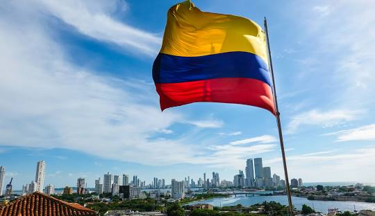

# Colombia

 

 

## Información General
Colombia, oficialmente República de Colombia, es un país ubicado en la región noroccidental de América del Sur. Limita al norte con el mar Caribe, al este con Venezuela y Brasil, al sur con Perú y Ecuador, y al oeste con Panamá y el océano Pacífico.

## Datos Básicos
- **Capital:** Bogotá
- **Idioma Oficial:** Español
- **Moneda:** Peso colombiano (COP)
- **Población:** Aproximadamente 50 millones de habitantes
- **Superficie:** 1,141,748 km²

## Población
- 52.32 millones

## Ciudades principales:
- **Bogota**
- **Medellin**
- **Cali**
- **Barranquilla**
- **Manizales**
- **Pereira**

